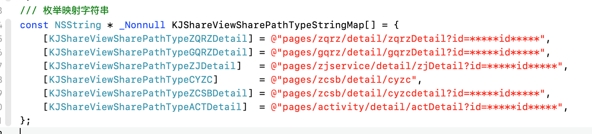
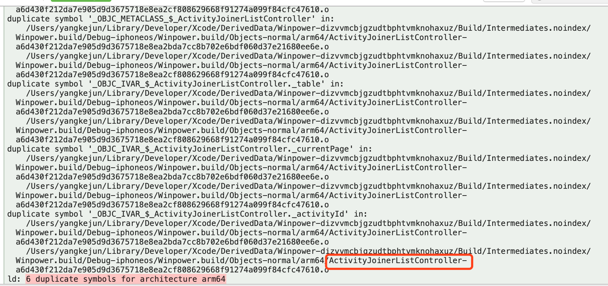

#iOS Bug汇总

####<font color=#FF0000 size=4>* Assets.xcassets报错</font>
Failed to find a suitable device for the type IBSimDeviceTypeiPad2x (com.apple.dt.Xcode.IBSimDeviceType.iPad-2x) with runtime iOS 12.4 (12.4 - 16G73) - com.apple.CoreSimulator.SimRuntime.iOS-12-4  
解决方案：Command + Shift + K 几次再重新 Command + R

####<font color=#FF0000 size=4>* 极光推送更换了BundleID之后、保存失败:Token Authentication 配置有误</font>  
解决网址：https://leancloud.cn/docs/ios_push_cert.html

####<font color=#FF0000 size=4>* 运行就崩，控制台打印如下信息</font>  
```
dyld: Library not loaded: @rpath/libswiftCore.dylib
Referenced from: /var/containers/Bundle/Application/A81A055C-4D20-4F40-9EB1-76B2A93197CA/Winpower.app/Winpower
  Reason: no suitable image found.  Did find:
	/private/var/containers/Bundle/Application/A81A055C-4D20-4F40-9EB1-76B2A93197CA/Winpower.app/Frameworks/libswiftCore.dylib: code signature invalid for '/private/var/containers/Bundle/Application/A81A055C-4D20-4F40-9EB1-76B2A93197CA/Winpower.app/Frameworks/libswiftCore.dylib'  
```
原因：名字重复使用过  
解决方案：  
1、退出 Xcode  
2、重启电脑  
3、找到 DerivedData 文件夹 删除 (路径:~/Library/Developer/Xcode/DerivedData)  
4、删除 com.apple.dt.Xcode 文件 (路径:~/Library/Caches/com.apple.dt.Xcode)

####<font color=#FF0000 size=4>* Xib报错</font>

解决方案：重启电脑，然后重启Xcode

####<font color=#FF0000 size=4>* 828 duplicate symbols for architecture arm64</font>  
因为我写的枚举映射
<p align="left">
  
</p>
解决方案:  
声明方式改为 <font color=#0099FF size=2.5>static NSString * const _Nonnull KJShareViewSharePathTypeStringMap[]</font> 

####<font color=#FF0000 size=4>* Cannot form weak reference to instance (0x1089cf000) of class HTML5ViewController. It is possible that this object was over-released, or is in the process of deallocation.</font>  
原因：A控制器设置了委托，然后跳转到B控制器，当A控制器 push到B控制器，然后B控制器又pop到A控制器，出现对象被过度释放，或正在被释放的过程中  
解决方案：在B将要退出时把delegate = nil
在dealloc中清空代理，手动释放delegate

####<font color=#FF0000 size=4>* 设置渐变色之后Label上面文字不显示</font>  
原因：设置渐变后，发现Label上的字体不显示，想着设置方法在layer加载后，测试发现还是不行，把背景颜色的透明度改为0，发现背景色覆盖住字体  
解决方案：[label.layer insertSublayer:gradientLayer0 atIndex:0];

####<font color=#FF0000 size=4>* 6 duplicate symbols for architecture arm64</font>  
<p align="left">
  
</p>
原因：文件重复  
解决方案：全局搜索一下多余的文件（ActivityJoinerListController）找到对应的多余文件删除即可

###iOS13以后遇见的一些BUG
####<font color=#FF0000 size=4>* LSDefaults sharedInstance]: unrecognized selector sent to class</font>  
原因：更新到13以后，报错友盟已经提示了，需要把UMCCommon更新到最新版本2.1.1  
解决方案：pod 'UMCCommon', '~> 2.1.1'，然后pod install

####<font color=#FF0000 size=4>* 不适配深色模式 更新到ios 13.1.2之后系统开启暗黑模式</font>  
App背景和文字相对应的做出了反转  
禁用App暗黑模式  
在info.plist当中新增如下键值对
```
<key>UIUserInterfaceStyle</key>
<string>Light</string>
```


####<font color=#FF0000 size=4>* iOS13以后 presentViewController 过去的控制器可以滑动和顶部少一截问题</font>  
解决方案：写一个UIViewController的类别    

```
#import "UIViewController+KJFullScreen.h"
@implementation UIViewController (KJFullScreen)
+ (void)load{
    static dispatch_once_t onceToken;
    dispatch_once(&onceToken, ^{
        SEL originalSelector = @selector(presentViewController:animated:completion:);
        SEL swizzledSelector = @selector(kj_presentViewController:animated:completion:);
        Class class = [self class];
        Method originalMethod = class_getInstanceMethod(class, originalSelector);
        Method swizzledMethod = class_getInstanceMethod(class, swizzledSelector);
        if (class_addMethod(class, originalSelector, method_getImplementation(swizzledMethod), method_getTypeEncoding(swizzledMethod))) {
            class_replaceMethod(class, swizzledSelector, method_getImplementation(originalMethod), method_getTypeEncoding(originalMethod));
        } else {
            method_exchangeImplementations(originalMethod, swizzledMethod);
        }
    });
}
- (void)kj_presentViewController:(UIViewController *)vc animated:(BOOL)animated completion:(void (^)(void))completion{
    if (@available(iOS 13.0, *)) {
        vc.modalPresentationStyle = UIModalPresentationFullScreen;/// 充满全屏
    }
    [self kj_presentViewController:vc animated:animated completion:completion];
}
@end
```
####<font color=#FF0000 size=4>* UISegmentedControl解决修改不了 backgroundColor 和 tintColor</font>  
解决方案:解决修改不了 backgroundColor 和 tintColor

```
#import "UISegmentedControl+KJCustom.h"
@implementation UISegmentedControl (KJCustom)
- (void)kj_ensureBackgroundAndTintColor {
    if (@available(iOS 13, *)) {
        UIColor *tintColor = [self tintColor];
        UIImage *tintColorImage = [self imageWithColor:tintColor];
        [self setBackgroundImage:[self imageWithColor:self.backgroundColor ? self.backgroundColor : [UIColor clearColor]] forState:UIControlStateNormal barMetrics:UIBarMetricsDefault];
        [self setBackgroundImage:tintColorImage forState:UIControlStateSelected barMetrics:UIBarMetricsDefault];
        [self setBackgroundImage:[self imageWithColor:[tintColor colorWithAlphaComponent:0.2]] forState:UIControlStateHighlighted barMetrics:UIBarMetricsDefault];
        [self setBackgroundImage:tintColorImage forState:UIControlStateSelected|UIControlStateSelected barMetrics:UIBarMetricsDefault];
        [self setDividerImage:tintColorImage forLeftSegmentState:UIControlStateNormal rightSegmentState:UIControlStateNormal barMetrics:UIBarMetricsDefault];
        self.layer.borderWidth = 1;
        self.layer.borderColor = [tintColor CGColor];
    }
}
- (UIImage *)imageWithColor:(UIColor*)color {
    CGRect rect = CGRectMake(0.0f, 0.0f, 1.0f, 1.0f);
    UIGraphicsBeginImageContext(rect.size);
    CGContextRef context = UIGraphicsGetCurrentContext();
    CGContextSetFillColorWithColor(context, [color CGColor]);
    CGContextFillRect(context, rect);
    UIImage *theImage = UIGraphicsGetImageFromCurrentImageContext();
    UIGraphicsEndImageContext();
    return theImage;
}
@end
```
####<font color=#FF0000 size=4>* thread 1:exc _bad _access(code=1,address=0x70000008)</font>  


错误原因：定义字符串属性时使用`assign`  （访问了已经释放的对象导致）  
解决方案：开启NSZombieEnabled（僵尸模式）
