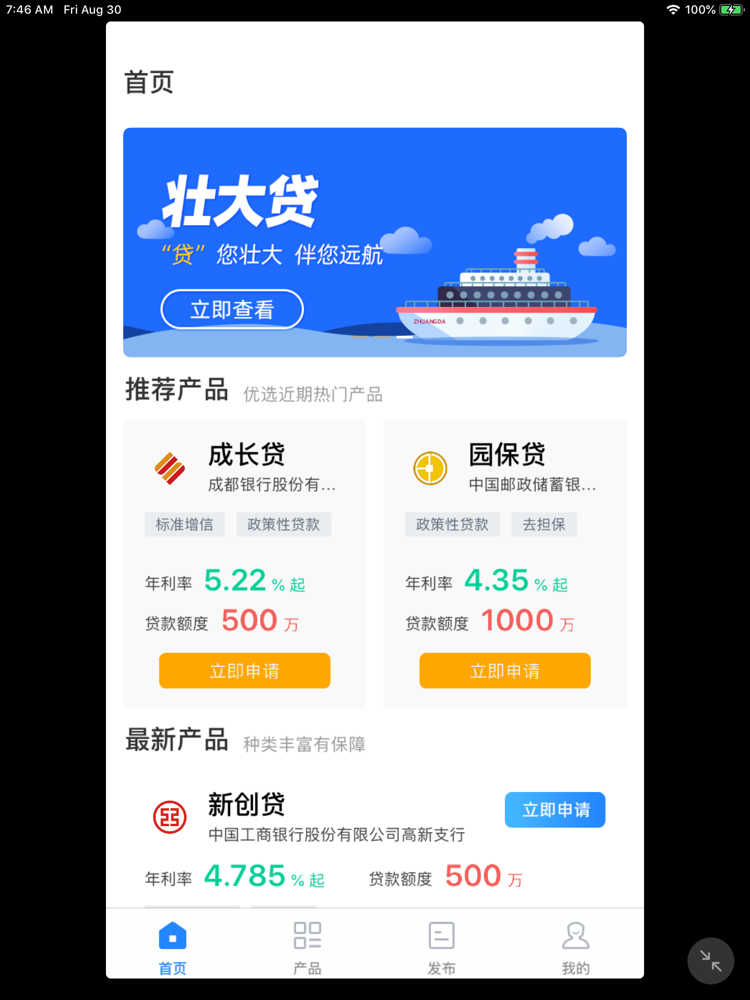
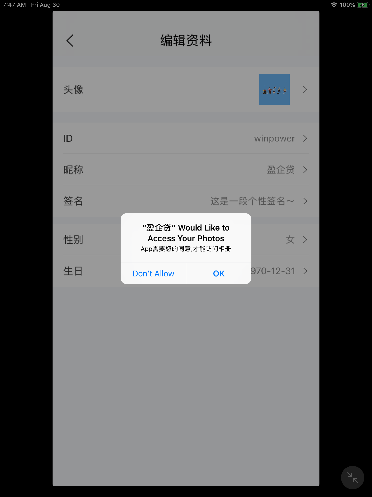
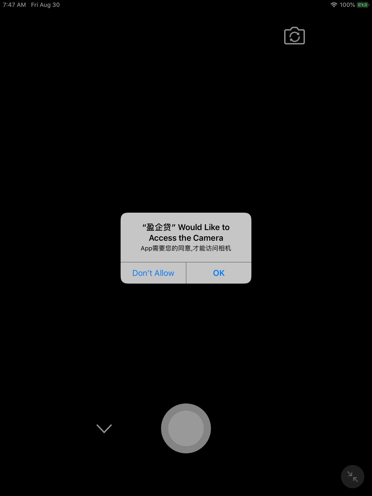
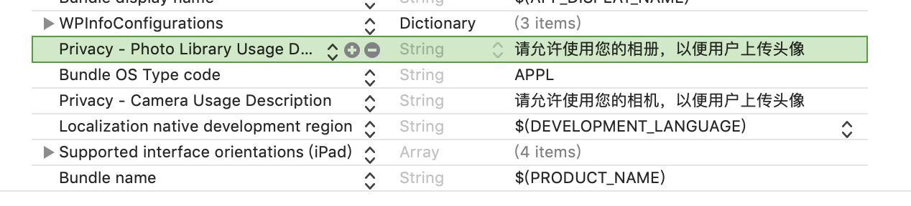

# 审核被拒整理

####Guideline 2.5.1 - Performance - Software Requirements

```
发件人 Apple
2.5 Performance: Software Requirements
Guideline 2.5.1 - Performance - Software Requirements

Your app uses the "prefs:root=" non-public URL scheme, which is a private entity. The use of non-public APIs is not permitted on the App Store because it can lead to a poor user experience should these APIs change.

Specifically, your app uses the following non-public URL scheme:

prefs:root=general&path=restrictions

Continuing to use or conceal non-public APIs in future submissions of this app may result in the termination of your Apple Developer account, as well as removal of all associated apps from the App Store.

Next Steps

To resolve this issue, please revise your app to provide the associated functionality using public APIs or remove the functionality using the "prefs:root" or "App-Prefs:root" URL scheme.

If there are no alternatives for providing the functionality your app requires, you can use Feedback Assistant to submit an enhancement request.
```
原因：本人代码中使用了这句

```
// 打开设置->通用->通知
[[UIApplication sharedApplication] openURL:[NSURL URLWithString:@"prefs:root=General&path=Restrictions"]];

```
解决办法：使用私有api导致被拒，找到”prefs:root”，用相应方法换掉，再重新打包上传即可

####Guideline 2.1 - Performance - App Completeness
```
发件人 Apple
2. 1 Performance: App Completeness
Guideline 2.1 - Performance - App Completeness
We discovered one or more bugs in your app when reviewed on iPad running iOS 12.4 on Wi-Fi.
Specifically, your app was not responsive when we tapped 立即登录.
Please see attached screenshots for details.

Next Steps
To resolve this issue, please run your app on a device to identify any issues, then revise and resubmit your app for review.
If we misunderstood the intended behavior of your app, please reply to this message in Resolution Center to provide information on how these features were intended to work.
For new apps, uninstall all previous versions of your app from a device, then install and follow the steps to reproduce the issue. For updates, install the new version as an update to the previous version, then follow the steps to reproduce the issue.
Resources
For information about testing your app and preparing it for review, please see Technical Note TN2431: App Testing Guide. 
For a networking overview, please review About Networking.
Please see attached screenshot for details.
```
原因：App存在Bug，写的假的登录被查询出来- -。  
解决方案：按照下面的提示图片对应做出修改即可
<p align="left">
  
</p>


####Guideline 3.2.1 - Business - Other Business Model Issues - Acceptable
```
We found that your app facilitates loan applications, but the seller and company names associated with your app do not reflect the financial institution in the app or its metadata, as required by Guideline 3.2.1(viii) of the App Store Review Guidelines.

Next Steps

To help us proceed with the review of your app, please provide the following information. The more information you can provide upfront, the sooner we can complete your review.

- Both a copy and the direct link to the government website of your Business License (营业执照)
- Your app’s and service’s Terms & Conditions. 
- In the case of dispute, what resolution mechanism does your app and service offer? 
- What is your responsibility in such case? Is such responsibility stated clearly in the Terms & Conditions? 
- How will the involved parties trace one another?

Additionally, please ensure your app’s Support and Privacy URLs in the metadata direct users to the webpages with appropriate information.

Please attach documentary evidence in the App Review Information section in App Store Connect. In accordance with section 3.2(f) of the Apple Developer Program License Agreement, you acknowledge that submitting falsified or fraudulent documentation can result in the termination of your Apple Developer Program account and the removal of your apps from the App Store. Once Legal has reviewed your documentation and confirms its validity, we will proceed with the review of your app.
```
原因：因为我上传的是一款金融类的App，需要相关的资质  
解决方案：在附件中上传相关的资质即可
<p align="left">
  
</p>


####Guideline 5.1.1 - Legal - Privacy - Data Collection and Storage
```
We noticed that your app requests the user’s consent to access their camera and photos but does not clarify the use of the camera and photos in the applicable purpose string.

Next Steps

Please revise the relevant purpose string in your app’s Info.plist file to specify why the app is requesting access to the user's camera and photos. You can modify your app's Info.plist file using the property list editor in Xcode.

To help users understand why your app is requesting access to their personal data, all permission request alerts in your app should specify how your app will use the requested feature.

Resources

For additional information and instructions on requesting permission, please review the Requesting Permission section of the iOS Human Interface Guidelines and the Information Property List Key Reference. You may also want to review the Technical Q&A QA1937: Resolving the Privacy-Sensitive Data App Rejection page for details on how to provide a usage description for permission request alerts.

Please see attached screenshots for details.
```
原因：未对使用的相机权限和照片权限做出合理的说明  
<p align="left">
  
  
</p>
解决方案：合理说明即可
<p align="left">
  
</p>